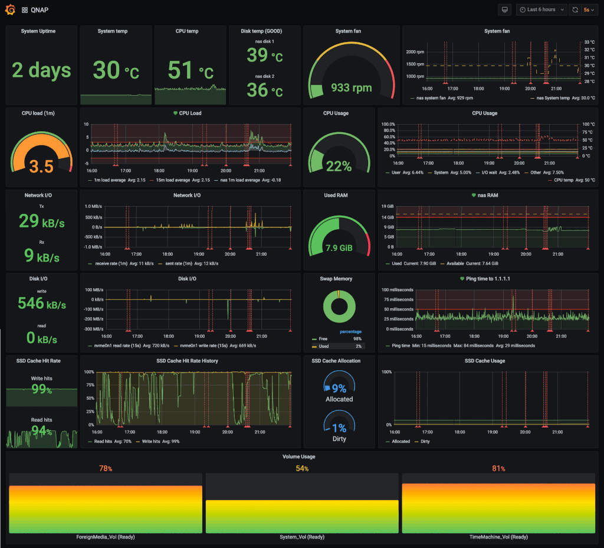
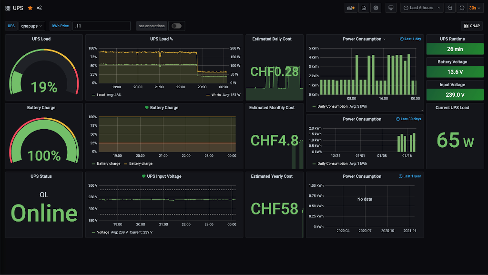
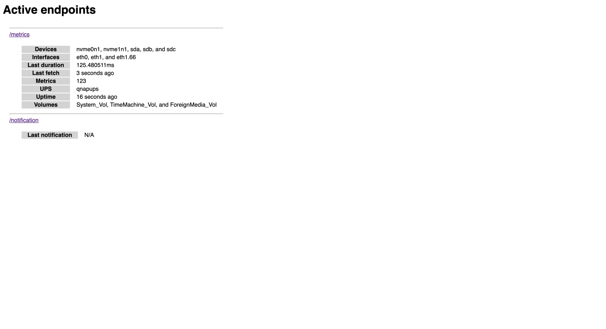

[](https://github.com/pedropombeiro/qnapexporter/actions/workflows/main.yml)

# qnapexporter

`qnapexporter` is a simple Go program meant to be run in the background on a QNAP NAS in order to export
relevant metrics to Prometheus. It exposes an HTTP `/metrics` endpoint which generates a standard Prometheus metrics file, and a `/notifications` endpoint which can simulate an SMSC endpoint for QNAP notifications.

The data produced by this exporter can be used to create Grafana dashboards such as the following:





The Grafana dashboard sources are in the `/dashboards` directory.

## Installation (from binaries)

1. Download the latest qnapexporter executable from the [Releases page](https://github.com/pedropombeiro/qnapexporter/releases)
1. Run `qnapexporter`

```shell
./qnapexporter
```

    Normally it should be run as a background task. Unfortunately this is not easy on a QNAP NAS.
    See for example [this forum post](https://forum.qnap.com/viewtopic.php?t=44743#p198192) for ideas on how to achieve it.

## Installation (alternative, from qpkg)

1. Download the latest qnapexporter qpkg package from the [Releases page](https://github.com/pedropombeiro/qnapexporter/releases)
1. Via web ui in QNAP, use manual installation in App Center. Please note that the installation will issue a warning because the QPKG package is not signed. When the binary is installed via QPKG, it will automatically start as background task and can be also stopped/started via App Center.

## Prometheus configuration

Add target to `scrape_configs` section of `prometheus.ini`

```yaml
- job_name: 'qnap'
  scrape_interval: 10s
  honor_labels: true
  static_configs:
  - targets: ['localhost:9094']
```

## Customization

qnapexporter supports the following command line flags:

| Flag                    | Default value | Description |
|-------------------------|---------------|-------------|
| `--port`                | `:9094`       | Address/port where to serve the metrics  |
| `--ping-target`         | `1.1.1.1`     | Host to periodically ping                |
| `--healthcheck`         | N/A           | Healthcheck service to ping every 5 minutes (currently supported: `healthchecks.io:<check-id>`)  |
| `--grafana-url`         | N/A           | Grafana host (e.g.: https://grafana.example.com), also settable through `GRAFANA_URL` environment variable  |
| `--grafana-auth-token`  | N/A           | Grafana API token for annotations, also settable through `GRAFANA_AUTH_TOKEN` environment variable  |
| `--grafana-tags`        | `nas`         | List of Grafana tags for annotations, also settable through `GRAFANA_TAGS` environment variable  |
| `--log`                 | N/A           | Path to log file (defaults to standard output)  |

### Configuring support for QNAP events as Grafana annotations

qnapexporter can expose QNAP events as Grafana annotations, to make it easy to understand what is happening on the NAS. To configure the support:

1. Log in to the NAS web interface
2. Open `Notification Center`, then `Service Account and Device Pairing`
3. In the `SMS` tab, click the `Add SMSC Service` button
   1. In `SMS service provider`, select `custom`
   2. Set `Alias` to `qnapexporter`
   3. Set `URL template text` to `http://localhost:9094/notification?phone_number=@@PhoneNumber@@&text=@@Text@@`. Customize the port to match whatever is passed to `--port`.
   4. Confirm the settings.
4. In the Grafana web UI, go to `Configuration`, `API Keys`
   1. Press `Add API key`
   2. Set `Key name` to `qnapexporter`
   3. Set `Role` to `Editor`
   4. Press `Add`
   5. Take note of the created token (this will be passed to qnapexporter with `--grafana-auth-token`)

## Tips

The root endpoint exposes information about the current status of the program (useful for debugging):


